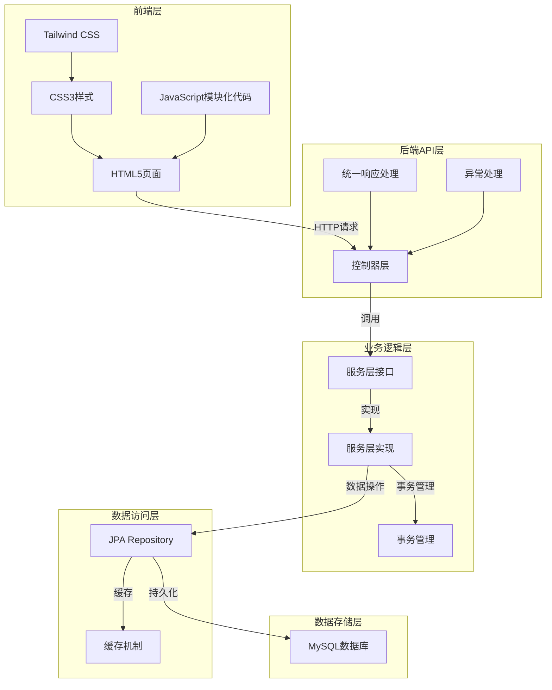

# 宠物健康管理系统 - 项目架构文档

## 1. 系统架构概览

### 1.1 整体架构
宠物健康管理系统采用分层架构设计，分为前端层、后端API层、业务逻辑层、数据访问层和数据存储层。系统采用前后端分离的设计模式，前端通过HTTP请求与后端API进行交互。



### 1.2 技术栈

| 类别 | 技术/框架 | 版本 | 用途 |
|------|-----------|------|------|
| 后端框架 | Spring Boot | 4.0.5 | 应用核心框架 |
| 数据库 | MySQL | 8.x | 数据存储 |
| 认证 | JWT | - | 身份验证 |
| ORM | Hibernate | - | 对象关系映射 |
| 前端 | HTML5 | - | 页面结构 |
| 前端 | CSS3 | - | 页面样式 |
| 前端 | JavaScript | - | 前端逻辑 |
| 前端 | Tailwind CSS | - | 响应式样式框架 |
| 测试 | JUnit | 5.x | 单元测试 |
| 测试 | Mockito | - | 模拟测试 |
| 缓存 | Spring Cache | - | 数据缓存 |
| 缓存 | Ehcache | - | 缓存实现 |

## 2. 模块结构

### 2.1 后端模块结构

```
src/main/java/com/pethealth/system/
├── config/          # 配置类
│   ├── JwtAuthenticationFilter.java  # JWT认证过滤器
│   └── SecurityConfig.java           # 安全配置
├── controller/      # 控制器层
│   ├── ArticleController.java        # 文章控制器
│   ├── BehaviorTrainingController.java  # 行为训练控制器
│   ├── ChatAssistantController.java  # 聊天助手控制器
│   ├── ChatController.java           # 聊天控制器
│   ├── ConsultationController.java   # 咨询控制器
│   ├── FeedGuideController.java      # 喂养指南控制器
│   ├── HealthRecordController.java   # 健康记录控制器
│   ├── HomeController.java           # 首页控制器
│   ├── LifePlanController.java       # 生活方案控制器
│   ├── PetController.java            # 宠物控制器
│   ├── SlideController.java          # 轮播图控制器
│   ├── Text2SQLController.java       # Text2SQL控制器
│   └── UserController.java           # 用户控制器
├── dto/             # 数据传输对象
│   └── ResponseDTO.java              # 统一响应对象
├── entity/          # 实体类
│   ├── Article.java                  # 文章实体
│   ├── Consultation.java             # 咨询实体
│   ├── HealthRecord.java             # 健康记录实体
│   ├── Pet.java                      # 宠物实体
│   ├── Slide.java                    # 轮播图实体
│   └── User.java                     # 用户实体
├── exception/       # 异常处理
│   ├── BusinessException.java        # 业务异常
│   └── GlobalExceptionHandler.java   # 全局异常处理器
├── repository/      # 数据访问层
│   ├── ArticleRepository.java        # 文章仓库
│   ├── ConsultationRepository.java   # 咨询仓库
│   ├── HealthRecordRepository.java   # 健康记录仓库
│   ├── PetRepository.java            # 宠物仓库
│   ├── SlideRepository.java          # 轮播图仓库
│   └── UserRepository.java           # 用户仓库
├── service/         # 业务逻辑层
│   ├── impl/        # 服务实现
│   │   ├── ArticleServiceImpl.java        # 文章服务实现
│   │   ├── BehaviorTrainingServiceImpl.java  # 行为训练服务实现
│   │   ├── ChatAssistantServiceImpl.java  # 聊天助手服务实现
│   │   ├── ChatServiceImpl.java           # 聊天服务实现
│   │   ├── ConsultationServiceImpl.java   # 咨询服务实现
│   │   ├── FeedGuideServiceImpl.java      # 喂养指南服务实现
│   │   ├── HealthRecordServiceImpl.java   # 健康记录服务实现
│   │   ├── HomeServiceImpl.java           # 首页服务实现
│   │   ├── LifePlanServiceImpl.java       # 生活方案服务实现
│   │   ├── PetServiceImpl.java            # 宠物服务实现
│   │   ├── SlideServiceImpl.java          # 轮播图服务实现
│   │   └── Text2SQLServiceImpl.java       # Text2SQL服务实现
│   ├── ArticleService.java        # 文章服务接口
│   ├── BehaviorTrainingService.java  # 行为训练服务接口
│   ├── ChatAssistantService.java  # 聊天助手服务接口
│   ├── ChatService.java           # 聊天服务接口
│   ├── ConsultationService.java   # 咨询服务接口
│   ├── FeedGuideService.java      # 喂养指南服务接口
│   ├── HealthRecordService.java   # 健康记录服务接口
│   ├── HomeService.java           # 首页服务接口
│   ├── LifePlanService.java       # 生活方案服务接口
│   ├── PetService.java            # 宠物服务接口
│   ├── SlideService.java          # 轮播图服务接口
│   ├── Text2SQLService.java       # Text2SQL服务接口
│   ├── UserDetailsServiceImpl.java  # 用户详情服务实现
│   └── UserService.java           # 用户服务接口
├── utils/           # 工具类
│   └── JwtUtil.java                 # JWT工具类
└── PetHealthSystemApplication.java  # 应用主类
```

### 2.2 前端模块结构

```
frontend/
├── src/
│   ├── css/
│   │   └── tailwind.css            # Tailwind CSS样式
│   └── js/
│       ├── modules/                # 模块化JavaScript
│       │   ├── api.js              # API请求模块
│       │   ├── article.js           # 文章交互模块
│       │   ├── auth.js             # 用户认证模块
│       │   ├── storage.js          # 本地存储模块
│       │   └── ui.js               # UI交互模块
│       └── main.js                 # 前端主脚本
├── ai-chat.html                   # AI聊天页面
├── behavior.html                  # 行为训练页面
├── chat.html                      # 聊天页面
├── community.html                 # 社区页面
├── consultation.html              # 咨询服务页面
├── feed.html                      # 喂养指南页面
├── health.html                    # 健康记录页面
├── index.html                     # 首页
├── life-plan.html                 # 生活方案页面
├── login.html                     # 登录页面
├── pets.html                      # 宠物管理页面
├── profile.html                   # 个人中心页面
├── package.json                   # 前端依赖配置
├── postcss.config.js              # PostCSS配置
└── tailwind.config.js             # Tailwind配置
```

## 3. 核心功能模块

### 3.1 用户认证模块
- **功能**: 用户注册、登录、个人资料管理、密码修改
- **流程**: 用户注册 → 登录获取JWT令牌 → 携带令牌访问受保护资源
- **关键类**: UserController、UserServiceImpl、JwtUtil

### 3.2 宠物管理模块
- **功能**: 添加宠物、查看宠物列表、编辑宠物信息、删除宠物
- **流程**: 用户登录 → 管理宠物信息 → 保存到数据库
- **关键类**: PetController、PetServiceImpl、PetRepository

### 3.3 健康记录模块
- **功能**: 添加健康记录、查看健康记录列表、编辑健康记录、删除健康记录
- **流程**: 用户登录 → 选择宠物 → 管理健康记录 → 保存到数据库
- **关键类**: HealthRecordController、HealthRecordServiceImpl、HealthRecordRepository

### 3.4 在线咨询模块
- **功能**: 提交咨询、查看咨询列表、查看咨询详情、AI智能咨询
- **流程**: 用户登录 → 提交咨询 → 专业人员回复 → 用户查看回复
- **关键类**: ConsultationController、ConsultationServiceImpl、ChatAssistantServiceImpl

### 3.5 健康方案模块
- **功能**: 生成健康方案、查看方案列表、查看方案详情
- **流程**: 用户登录 → 选择宠物 → 生成健康方案 → 查看方案详情
- **关键类**: LifePlanController、LifePlanServiceImpl

### 3.6 文章资讯模块
- **功能**: 查看文章列表、查看文章详情、文章点赞、文章收藏
- **流程**: 用户访问首页 → 浏览文章 → 互动操作
- **关键类**: ArticleController、ArticleServiceImpl、ArticleRepository

## 4. 数据流

### 4.1 用户注册流程
1. 前端提交注册信息
2. 后端验证用户名和邮箱是否已存在
3. 加密密码
4. 保存用户信息到数据库
5. 返回注册结果

### 4.2 宠物添加流程
1. 用户登录并提交宠物信息
2. 后端验证用户身份
3. 保存宠物信息到数据库
4. 返回添加结果

### 4.3 健康记录添加流程
1. 用户登录并选择宠物
2. 提交健康记录信息
3. 后端验证用户身份和宠物所有权
4. 保存健康记录到数据库
5. 返回添加结果

### 4.4 咨询提交流程
1. 用户登录并选择宠物
2. 提交咨询信息
3. 后端验证用户身份和宠物所有权
4. 保存咨询信息到数据库
5. 返回提交结果

### 4.5 AI咨询流程
1. 用户登录并进入AI咨询页面
2. 提交咨询问题
3. 后端调用Dify智能体API
4. 获取AI回复并返回给前端
5. 前端显示AI回复

## 5. 配置管理

### 5.1 环境配置
- **开发环境**: application-dev.yml
- **测试环境**: application-test.yml
- **生产环境**: application-prod.yml

### 5.2 核心配置项
- **数据库配置**: 连接字符串、用户名、密码
- **JWT配置**: 密钥、过期时间
- **AI服务配置**: API地址、API密钥、应用ID
- **服务器配置**: 端口、上下文路径

## 6. 安全设计

### 6.1 认证机制
- 使用JWT进行身份验证
- 密码使用BCrypt加密存储
- 敏感操作需要验证用户身份

### 6.2 授权机制
- 基于角色的访问控制
- 资源访问权限检查
- API接口权限控制

### 6.3 安全防护
- 防止SQL注入攻击
- 防止XSS攻击
- 防止CSRF攻击
- 敏感信息加密存储

## 7. 性能优化

### 7.1 后端优化
- 使用Spring Cache缓存热点数据
- 优化JPA查询，减少数据库访问
- 使用索引提高查询性能
- 实现分页查询，减少数据传输量

### 7.2 前端优化
- 模块化JavaScript代码
- 优化API调用，减少请求次数
- 使用浏览器缓存
- 响应式设计，适配不同设备

## 8. 扩展性设计

### 8.1 模块化设计
- 采用分层架构，各模块职责清晰
- 服务接口与实现分离，便于替换实现
- 配置文件与代码分离，便于配置管理

### 8.2 可扩展性
- 支持添加新的功能模块
- 支持集成第三方服务
- 支持水平扩展

## 9. 监控与日志

### 9.1 日志管理
- 使用SLF4J进行日志记录
- 不同级别的日志配置
- 关键操作日志记录

### 9.2 监控
- Spring Boot Actuator监控端点
- 健康检查
- 性能指标监控

## 10. 部署与维护

### 10.1 部署方式
- 本地开发环境
- 生产环境部署
- Docker容器化部署

### 10.2 维护策略
- 定期备份数据库
- 监控系统运行状态
- 及时更新依赖库
- 安全漏洞修复

## 11. 总结

宠物健康管理系统采用分层架构设计，具有良好的可维护性、可扩展性和性能表现。系统功能完整，包括用户认证、宠物管理、健康记录、在线咨询、健康方案和文章资讯等核心模块。通过使用Spring Boot、JWT、JPA等技术，系统实现了安全、高效的服务。前端采用HTML5、CSS3和JavaScript，结合Tailwind CSS实现了响应式设计，提供了良好的用户体验。

系统的架构设计和代码实现遵循了最佳实践，为后续的功能扩展和系统维护奠定了坚实的基础。